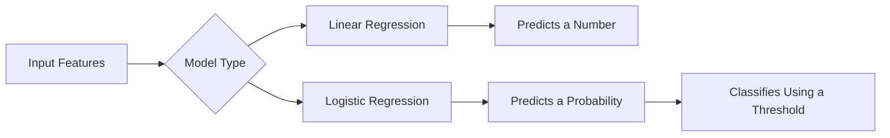
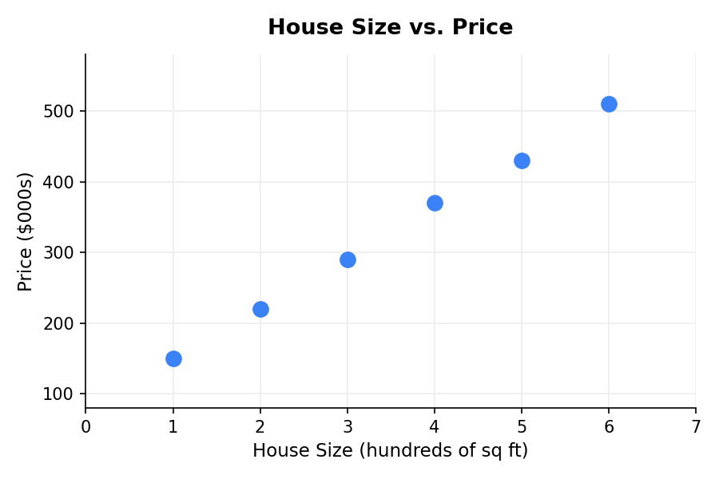
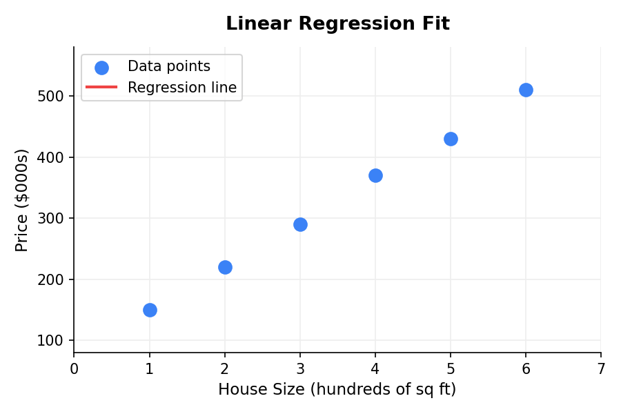
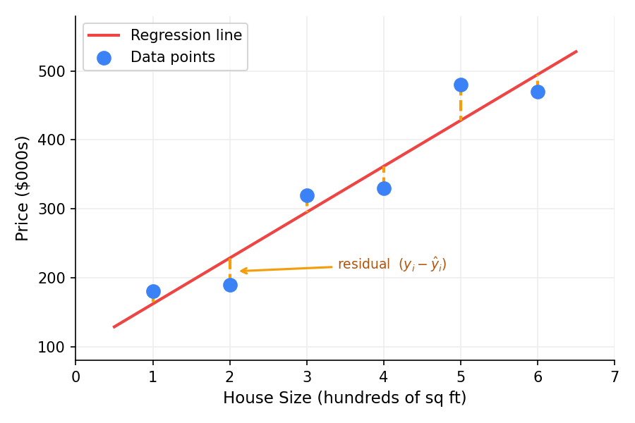
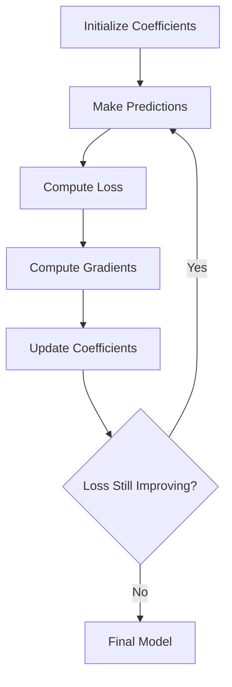
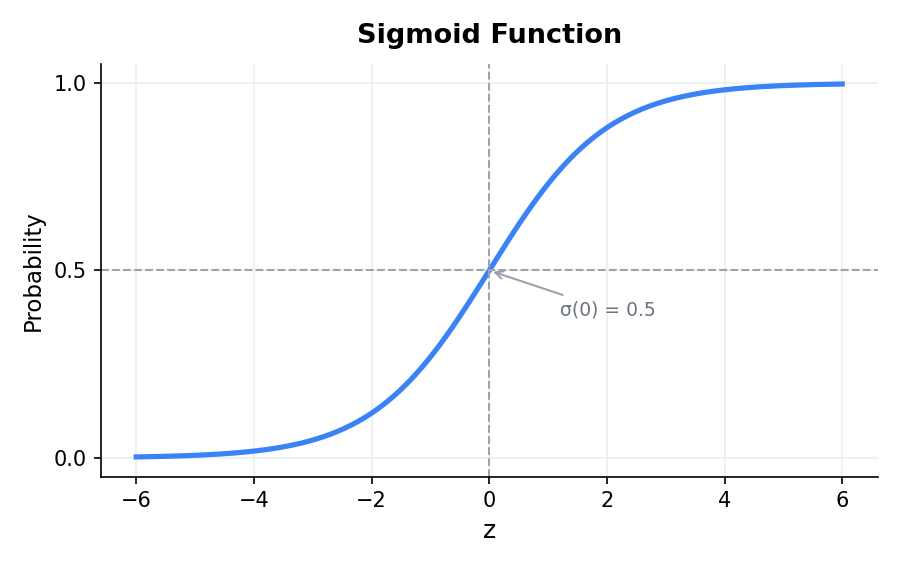
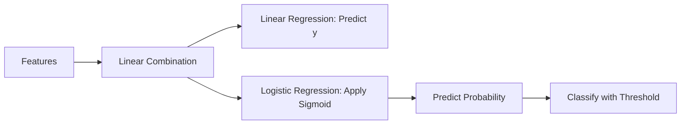

# Linear and Logistic Regression: The Two Models That Power a Surprising Amount of Machine Learning

*An intuitive, equation-friendly guide to the regression models every data scientist should understand.*

---

If you've spent any time around machine learning, you've probably heard linear regression and logistic regression described as "beginner" models — the stuff you learn in week one and then move past.

That framing never quite sat right with me.

Yes, you can pick these up early. But these same models show up in production forecasting systems, clinical research, financial risk models, and A/B testing pipelines at some of the most sophisticated organizations in the world. "Beginner" doesn't mean "limited" — it means "foundational."

And that's exactly what makes them worth understanding deeply. Buried inside these two models are the core ideas that power almost everything else in machine learning:

* How models learn from data
* How predictions are made
* How loss functions work
* How optimization works
* How coefficients can be interpreted
* How probability enters machine learning

Think of this post as a proper introduction — one that doesn't just show you the equations, but explains the intuition behind them, the assumptions you're making, how to evaluate your results, and where things can go wrong.

---

## The Big Picture

At a high level, both models try to learn a relationship between inputs and an output.

We usually write the input features as:

$$
x_1, x_2, \dots, x_p
$$

and the target variable as:

$$
y
$$

The difference is in the type of target we want to predict.

| Model               | Used For                       | Target Type          | Example                              |
| ------------------- | ------------------------------ | -------------------- | ------------------------------------ |
| Linear regression   | Predicting a continuous value  | Numeric              | House price, salary, temperature     |
| Logistic regression | Predicting a class probability | Categorical / binary | Spam or not spam, churn or not churn |

A simple mental model:

Put simply: linear regression predicts values, and logistic regression predicts probabilities.

---

# Part 1: Linear Regression

## What Is Linear Regression?

Linear regression models the relationship between one or more input variables and a continuous output variable.

The simplest version is **simple linear regression**, where we use one feature to predict one target.

For example:

> Can we predict someone's annual income based on years of experience?

The model assumes the relationship can be approximated by a straight line.

$$
\hat{y} = \beta_0 + \beta_1x
$$

If this looks familiar, it should. This is exactly the $y = mx + b$ equation from your first algebra class — just written with different letters. $\beta_0$ is the intercept (your old $b$), and $\beta_1$ is the slope (your old $m$). Linear regression is, at its core, fitting a line. The difference is that instead of drawing it by hand, we're letting the model find the line that best fits real data.

Where:

* $\hat{y}$ is the predicted value
* $x$ is the input feature
* $\beta_0$ is the intercept
* $\beta_1$ is the slope

The intercept tells us the predicted value when $x = 0$.

The slope tells us how much $\hat{y}$ changes when $x$ increases by one unit.

When you have more than one feature, the equation extends naturally — this is called **multiple linear regression**:

$$
\hat{y} = \beta_0 + \beta_1x_1 + \beta_2x_2 + \dots + \beta_px_p
$$

For example, to predict house price using size, number of bedrooms, and age:

$$
\widehat{\text{Price}} = \beta_0 + \beta_1(\text{Size}) + \beta_2(\text{Bedrooms}) + \beta_3(\text{Age})
$$

Each coefficient ($\beta_i$) measures the effect of one feature while holding the others constant. Same idea as the single-feature case — just more variables on the line.

---

## A Simple Linear Regression Diagram

Imagine we have data points showing house size and house price.

Linear regression fits the best straight line through those points.

That line becomes our prediction rule. Given a new house size, we can plug it into the equation and estimate the price.

---

---

## What Does "Best Fit" Mean?

Linear regression tries to find the line that minimizes prediction error.

For each data point:

$$
e_i = y_i - \hat{y}_i
$$

Where:

* $e_i$ is the residual
* $y_i$ is the actual value
* $\hat{y}_i$ is the predicted value

The model usually minimizes the **sum of squared residuals**:

$$
RSS = \sum_{i=1}^{n}(y_i - \hat{y}_i)^2
$$

Or the **mean squared error**:

$$
MSE = \frac{1}{n}\sum_{i=1}^{n}(y_i - \hat{y}_i)^2
$$

MSE is a sensible default, but it's not your only option. Squaring errors means large mistakes are penalized disproportionately — useful when you really want to avoid big misses, but less ideal if your data has outliers you don't want the model chasing. In those cases, **Mean Absolute Error (MAE)** is often a better fit since it treats all errors equally regardless of size. There are many other loss functions too — Huber loss, for example, blends the two by behaving like MSE for small errors and MAE for large ones. The right choice depends on how much you care about outliers and what kinds of errors are most costly in your specific problem.

---

## Visualizing Residuals

Each vertical gap between a point and the line is a residual.

Linear regression tries to make those gaps collectively as small as possible.

---

## The Closed-Form Solution

One reason linear regression is mathematically elegant is that it has a closed-form solution.

The optimal coefficient vector is:

$$
\hat{\beta} = (X^TX)^{-1}X^Ty
$$

This is called the **ordinary least squares** solution.

However, in large-scale machine learning, we often use iterative optimization methods such as **gradient descent**, especially when:

* The dataset is very large
* There are many features
* We use regularization
* Matrix inversion is computationally expensive

---

## Gradient Descent for Linear Regression

Gradient descent updates coefficients step by step to reduce the loss.

The cost function $J(\beta)$ measures how wrong the model currently is — it's the average squared error across all training examples, with the $\frac{1}{2n}$ out front just being a convenience that makes the derivative cleaner:

$$
J(\beta) = \frac{1}{2n}\sum_{i=1}^{n}(y_i - \hat{y}_i)^2
$$

The update rule says: take each coefficient, figure out which direction would reduce the cost, and nudge it a small step in that direction. $\alpha$ (the learning rate) controls how big each step is — too large and you overshoot, too small and training takes forever:

$$
\beta_j := \beta_j - \alpha \frac{\partial J}{\partial \beta_j}
$$

Where:

* $\alpha$ is the learning rate
* $\frac{\partial J}{\partial \beta_j}$ is the gradient
* $j$ indexes a coefficient

The gradient $\frac{\partial J}{\partial \beta_j}$ tells us the slope of the cost function with respect to each coefficient. For linear regression it works out to the average of each prediction error $(y_i - \hat{y}_i)$ weighted by the corresponding feature value $x_{ij}$ — intuitively, features that contributed more to the error get a bigger correction:

$$
\frac{\partial J}{\partial \beta_j} = -\frac{1}{n}\sum_{i=1}^{n}(y_i - \hat{y}_i)x_{ij}
$$

The intuition:

> Move the coefficients in the direction that reduces prediction error.

---

## Interpreting Linear Regression Coefficients

Suppose we fit this model:

$$
\widehat{\text{House Price}} = 50000 + 200(\text{Size}) + 15000(\text{Bedrooms})
$$

Then:

* The intercept is $50000$.
* Each additional square foot increases predicted price by $200$, holding bedrooms constant.
* Each additional bedroom increases predicted price by $15000$, holding size constant.

This "holding all else constant" interpretation is one of linear regression's biggest strengths.

It is not just predictive.

It is interpretable.

---

## Key Assumptions of Linear Regression

Linear regression doesn't require perfect data, but it does have a few expectations. Violating them doesn't always break your model — but it's worth knowing when you're on shaky ground.

### 1. Linearity

The relationship between your features and target should be roughly linear. If the true pattern is a curve, the model will struggle to capture it. A quick scatter plot before modeling goes a long way here.

### 2. Independent Errors

The errors shouldn't be correlated with each other. This one trips people up most often with time series data — if today's error predicts tomorrow's, you've got a problem. Same goes for clustered data like students from the same school or patients from the same hospital.

### 3. Constant Variance

The spread of your errors should stay roughly the same across all predicted values — this is called **homoscedasticity**. A healthy residual plot looks like random noise scattered evenly around zero. A problematic one fans out, with errors growing larger as predictions increase. If you see that fanning pattern, it's a sign your model is less reliable at the high end of its range.

### 4. No Severe Multicollinearity

If two features are highly correlated — say, house size in square feet and house size in square meters — the model has a hard time figuring out which one is doing the work. Coefficients become unstable and lose their interpretability.

### 5. Normally Distributed Errors

This one matters less for prediction and more if you're doing statistical inference (confidence intervals, hypothesis tests). The assumption is that errors are normally distributed around zero: $\epsilon \sim N(0, \sigma^2)$. For pure prediction tasks, you can often relax this.

---

## Evaluating Linear Regression

The most common metrics are **MAE**, **MSE**, **RMSE**, and **R²**. MAE gives you the average error in plain units — easy to interpret. MSE squares the errors, penalising big mistakes more heavily. RMSE brings that back to interpretable units. R² tells you how much of the target's variation the model explains — an R² of 0.80 means 80% accounted for, 20% not.

Each of these deserves its own deep dive, but the key thing to know here is: don't rely on a single metric, and always evaluate on held-out data. A model that looks great on training data can still fall apart in the real world.

---

# Part 2: Logistic Regression

## What Is Logistic Regression?

Despite the name, logistic regression is usually used for classification.

The most common version is **binary logistic regression**, where the target has two possible classes:

$$
y \in \{0, 1\}
$$

Examples:

* Customer churn: yes or no
* Email spam: spam or not spam
* Loan default: default or no default
* Disease diagnosis: positive or negative

There are extensions for other cases too — **multinomial logistic regression** handles targets with more than two unordered classes (e.g. predicting whether a user will buy, browse, or leave), and **ordinal logistic regression** handles ordered categories (e.g. ratings from 1 to 5). But binary is by far the most common, and the core ideas carry over directly.

Instead of predicting a continuous value directly, logistic regression predicts a probability.

$$
P(y = 1 \mid x)
$$

For example:

> "This customer has a 78% probability of churning."

---

## Why Not Use Linear Regression for Classification?

Suppose we try to use linear regression for a binary target.

$$
\hat{y} = \beta_0 + \beta_1x
$$

The problem is that linear regression can output any number:

$$
-\infty < \hat{y} < \infty
$$

But probabilities must be between 0 and 1:

$$
0 \leq P(y = 1 \mid x) \leq 1
$$

So logistic regression wraps the linear model inside a function that squashes values into the interval $(0, 1)$.

That function is the **sigmoid function**.

---

## The Sigmoid Function

The sigmoid function is:

$$
\sigma(z) = \frac{1}{1 + e^{-z}}
$$

It maps any real number to a value between 0 and 1.

When $z$ is very negative, the sigmoid is close to 0.

When $z$ is 0, the sigmoid is 0.5.

When $z$ is very positive, the sigmoid is close to 1.

---

## Logistic Regression Equation

First, logistic regression builds a linear score:

$$
z = \beta_0 + \beta_1x_1 + \beta_2x_2 + \dots + \beta_px_p
$$

Then it converts that score into a probability:

$$
\hat{p} = \sigma(z)
$$

So the full model is:

$$
\hat{p} = P(y = 1 \mid x) = \frac{1}{1 + e^{-(\beta_0 + \beta_1x_1 + \dots + \beta_px_p)}}
$$

The final prediction is often made using a threshold:

$$
\hat{y} =
\begin{cases}
1, & \text{if } \hat{p} \geq 0.5 \\
0, & \text{if } \hat{p} < 0.5
\end{cases}
$$

The threshold does not have to be 0.5. In medical diagnosis, fraud detection, or safety-critical systems, we may choose a different threshold depending on the cost of false positives and false negatives.

---

## The Logit: Linear Regression in Log-Odds Space

Here's something worth pausing on: logistic regression is still a linear model — just not linear in probability space. Instead, it's linear in **log-odds** space. That's a subtle but important distinction.

Odds are a way of expressing probability as a ratio of "how likely something is" versus "how likely it isn't":

$$
\text{odds} = \frac{p}{1-p}
$$

So if there's a 75% chance of rain, the odds are $\frac{0.75}{0.25} = 3$ — three times more likely to rain than not. Taking the logarithm of that gives us the **log-odds** (also called the **logit**):

$$
\log\left(\frac{p}{1-p}\right)
$$

What logistic regression actually models is a straight line in this log-odds space:

$$
\log\left(\frac{p}{1-p}\right) = \beta_0 + \beta_1x_1 + \dots + \beta_px_p
$$

This is one of the most important equations in logistic regression. It's what makes the model linear under the hood — each coefficient shifts the log-odds of the outcome up or down by a fixed amount.

Log-odds aren't very intuitive on their own, so in practice we usually exponentiate the coefficients. $e^{\beta_j}$ gives you the **odds ratio** — the multiplicative change in odds for a one-unit increase in $x_j$. A coefficient of 0.8 means $e^{0.8} \approx 2.23$, so that feature roughly doubles the odds of the outcome. That's a much easier number to reason about.

---

## Decision Boundary

When logistic regression makes a classification, it's essentially drawing a line through your data and asking: which side of the line does this point fall on?

That line — the **decision boundary** — is defined by where the model's predicted probability equals exactly 0.5. And that happens when the linear score $z$ equals zero, since $\sigma(0) = 0.5$. For two features, that gives you:

$$
\beta_0 + \beta_1x_1 + \beta_2x_2 = 0
$$

Everything on one side gets predicted as Class 1, everything on the other as Class 0. The boundary itself is the knife-edge where the model is maximally uncertain — a 50/50 call.

---

## Logistic Regression Loss Function

Linear regression uses squared error.

Logistic regression uses **log loss**, also called **binary cross-entropy**.

For one observation:

$$
L(y, \hat{p}) = -\left[y\log(\hat{p}) + (1-y)\log(1-\hat{p})\right]
$$

For the full dataset:

$$
J(\beta) = -\frac{1}{n} \sum_{i=1}^{n} \left[ y_i\log(\hat{p}_i) + (1-y_i)\log(1-\hat{p}_i) \right]
$$

This loss function heavily penalizes confident wrong predictions.

If the true label is 1 and the model predicts 0.99, the loss is small.

If the true label is 1 and the model predicts 0.01, the loss is huge.

That is exactly what we want.

---

There's also a deeper way to arrive at this same loss function. Logistic regression can be derived from **maximum likelihood estimation** — the idea of finding the coefficients that make your observed data as probable as possible under the model. It turns out that maximizing that likelihood leads to exactly the same objective as minimizing binary cross-entropy. The two framings are equivalent; cross-entropy is just the more practical lens for training.

---

## Gradient Descent for Logistic Regression

The logistic regression gradient has a surprisingly clean form.

Let:

$$
\hat{p}_i = \sigma(x_i^T\beta)
$$

Then the gradient of the average loss is:

$$
\frac{\partial J}{\partial \beta_j} = \frac{1}{n} \sum_{i=1}^{n} (\hat{p}_i - y_i)x_{ij}
$$

The update rule is:

$$
\beta_j := \beta_j - \alpha \frac{1}{n} \sum_{i=1}^{n} (\hat{p}_i - y_i)x_{ij}
$$

This looks similar to linear regression.

The model predicts, compares prediction to reality, and updates coefficients to reduce error.

---

## Evaluating Logistic Regression

Classification needs different metrics than regression. **Accuracy** is the obvious starting point — what fraction of predictions were correct — but it breaks down badly with imbalanced classes. A fraud model that never flags anything can still hit 98% accuracy if fraud is rare.

More useful are **precision** (of what we flagged, how much was real?), **recall** (of what was real, how much did we catch?), and **F1** (a single number balancing the two). Which one matters most depends entirely on the cost of each type of mistake — missing a cancer diagnosis is very different from sending a spam email to the wrong folder.

The **ROC curve** and its summary statistic **AUC** give a threshold-independent view of model quality, showing how well the model ranks positives above negatives across all possible cutoffs.

These metrics each deserve their own post — but knowing they exist and why accuracy alone isn't enough is the important takeaway here.

---

# Part 3: Linear vs Logistic Regression

Although they are related, linear and logistic regression solve different problems.

| Feature          | Linear Regression   | Logistic Regression                  |
| ---------------- | ------------------- | ------------------------------------ |
| Target           | Continuous          | Binary or categorical                |
| Output           | Numeric prediction  | Probability                          |
| Function         | Linear equation     | Sigmoid of linear equation           |
| Loss             | Mean squared error  | Binary cross-entropy                 |
| Prediction range | Any real number     | 0 to 1                               |
| Common metrics   | MAE, MSE, RMSE, R²  | Accuracy, precision, recall, F1, AUC |
| Example          | Predict house price | Predict churn probability            |

The shared idea is that both models start with a linear combination of features:

$$
z = \beta_0 + \beta_1x_1 + \dots + \beta_px_p
$$

Linear regression uses that directly:

$$
\hat{y} = z
$$

Logistic regression passes it through sigmoid:

$$
\hat{p} = \sigma(z)
$$

---

# Part 4: Regularization

When a model has too many features — or features that are correlated — it can start memorizing the training data rather than learning the underlying pattern. That's overfitting, and regularization is the standard fix.

The idea is simple: add a penalty to the loss function that discourages coefficients from getting too large. The two most common flavors are **Ridge** (L2) and **Lasso** (L1).

**Ridge** squares the coefficients in the penalty term:

$$
J(\beta) = \frac{1}{n}\sum_{i=1}^{n}(y_i - \hat{y}_i)^2 + \lambda \sum_{j=1}^{p}\beta_j^2
$$

It shrinks all coefficients toward zero but rarely eliminates any of them entirely. Good when you believe most features are contributing something.

**Lasso** uses absolute values instead:

$$
J(\beta) = \frac{1}{n}\sum_{i=1}^{n}(y_i - \hat{y}_i)^2 + \lambda \sum_{j=1}^{p}|\beta_j|
$$

The key difference: Lasso can push coefficients all the way to zero, effectively removing features from the model. That makes it a built-in feature selection tool — useful when you suspect only a handful of your features actually matter.

Both work equally well with logistic regression; you just apply the same penalty to the cross-entropy loss instead. In practice, $\lambda$ is a hyperparameter you tune — larger values mean more regularization and simpler models.

---

# Part 5: Practical Workflow

## Practical Tips for Linear Regression

Reach for linear regression when your target is a continuous number and interpretability matters — it's hard to beat when you need to explain *why* the model made a prediction, not just *what* it predicted. It's also a great first model to run before trying anything more complex.

The main things to watch for: outliers can pull the line in ways that hurt overall performance, highly correlated features make coefficients unreliable, and the model will happily extrapolate past your training data with no warning. If the relationship looks curved, you don't have to abandon linear regression — adding polynomial features like $x^2$ keeps you in the linear framework while capturing the curve. And if your target is heavily skewed, modeling $\log(y)$ instead often helps significantly.

---

## Practical Tips for Logistic Regression

Logistic regression is the natural starting point for any binary classification problem, especially when you need probabilities rather than just a yes/no answer and when being able to explain the model matters.

A few things worth keeping in mind: imbalanced classes are the most common pitfall — if 95% of your data is one class, accuracy will lie to you. And the default 0.5 threshold is just a starting point, not a rule. The right threshold depends on what's more costly in your situation — a fraud detection model might set it low to catch more suspicious cases, while a content moderation system might set it high to avoid false positives. Think about the cost of each type of mistake before you decide where to cut.

---

# Final Thoughts

Linear regression and logistic regression are not just beginner models.

They are the conceptual foundation of a large part of machine learning.

Linear regression teaches us how to model continuous outcomes, minimize squared error, interpret coefficients, and understand residuals.

Logistic regression teaches us how to model probabilities, classify outcomes, use cross-entropy loss, interpret odds, and reason about decision thresholds.

Their simplicity is a feature, not a weakness.

When you need a model that is fast, interpretable, mathematically clean, and surprisingly competitive, linear and logistic regression are often the best place to start.

---

*A quick note: we deliberately moved fast through a lot of topics in this post — evaluation metrics, regularization, gradient descent, loss functions, and more. Each of these deserves a proper deep dive of its own. Rest assured, we'll get to them.* :) 
